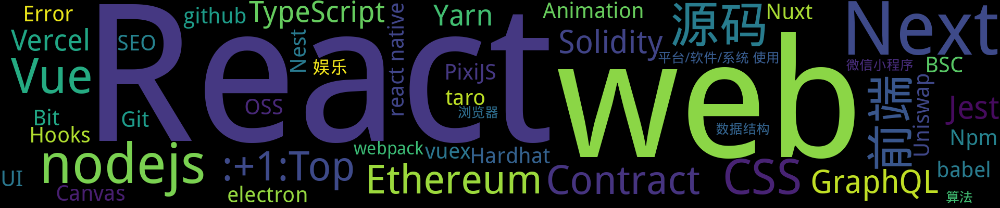

    
    
    
    
    
    
    

    

## Top :thumbsup: 
- [React](https://github.com/xiaotiandada/blog/issues/96)  0 :speech_balloon:  	 
## New :new: 

#### [Cross-Origin-Embedder-Policy](https://github.com/xiaotiandada/blog/issues/113) 0 :speech_balloon: 	 2022-06-07 15:38:38

:label: : [web](https://github.com/xiaotiandada/ghiblog/labels/web)

- https://developer.mozilla.org/zh-CN/docs/Web/HTTP/Headers/Cross-Origin-Embedder-Policy

[more](https://github.com/xiaotiandada/blog/issues/113)

---

#### [Cross-Origin-Opener-Policy](https://github.com/xiaotiandada/blog/issues/112) 0 :speech_balloon: 	 2022-06-07 15:34:31

:label: : [web](https://github.com/xiaotiandada/ghiblog/labels/web)

- https://developer.mozilla.org/en-US/docs/Web/HTTP/Headers/Cross-Origin-Opener-Policy

[more](https://github.com/xiaotiandada/blog/issues/112)

---

#### [Cross-Origin Resource Policy (CORP)](https://github.com/xiaotiandada/blog/issues/111) 0 :speech_balloon: 	 2022-06-07 15:32:21

:label: : [web](https://github.com/xiaotiandada/ghiblog/labels/web)

- https://developer.mozilla.org/en-US/docs/Web/HTTP/Cross-Origin_Resource_Policy_(CORP)
- https://web.dev/coop-coep/?utm_source=devtools
- https://w

[more](https://github.com/xiaotiandada/blog/issues/111)

---

#### [FileReader API](https://github.com/xiaotiandada/blog/issues/110) 0 :speech_balloon: 	 2022-06-04 16:58:54

:label: : 

- https://developer.mozilla.org/zh-CN/docs/Web/API/FileReader
- https://dev.to/j471n/preview-file-before-uploading-in-react-27kn

[more](https://github.com/xiaotiandada/blog/issues/110)

---

#### [theme](https://github.com/xiaotiandada/blog/issues/109) 0 :speech_balloon: 	 2022-05-26 15:40:41

:label: : [Next](https://github.com/xiaotiandada/ghiblog/labels/Next)

### Next.js
- https://github.com/xiaotiandada/next-theme
- https://github.com/xiaotiandada/next-theme/blob/main/pages/_app.tsx

如果需要 可以考虑用 cookie 

[more](https://github.com/xiaotiandada/blog/issues/109)

---

## 分类  :card_file_box: 

    

        
        
:cloud: 词云 :cloud: 点击词云展开详细分类:point_down: 

    

:+1:Top	1:newspaper:

- [React](https://github.com/xiaotiandada/blog/issues/96)  0 :speech_balloon:  	 

:framed_picture:封面	0:newspaper:

Animation	1:newspaper:

- [Animation case](https://github.com/xiaotiandada/blog/issues/104)  0 :speech_balloon:  	 

Bit	1:newspaper:

- [Bit 使用](https://github.com/xiaotiandada/blog/issues/90)  0 :speech_balloon:  	 

BSC	1:newspaper:

- [DAPP](https://github.com/xiaotiandada/blog/issues/82)  0 :speech_balloon:  	 

bug	0:newspaper:

Canvas	1:newspaper:

- [PixiJS](https://github.com/xiaotiandada/blog/issues/101)  0 :speech_balloon:  	 

Contract	2:newspaper:

- [DAPP](https://github.com/xiaotiandada/blog/issues/82)  0 :speech_balloon:  	 
- [Ethereum contract](https://github.com/xiaotiandada/blog/issues/46)  0 :speech_balloon:  	 

CSS	3:newspaper:

- [iPhoneX 安全区域](https://github.com/xiaotiandada/blog/issues/103)  0 :speech_balloon:  	 
- [为什么a标签中使用img后的高度多了几个像素？](https://github.com/xiaotiandada/blog/issues/102)  0 :speech_balloon:  	 
- [UI Swap](https://github.com/xiaotiandada/blog/issues/94)  0 :speech_balloon:  	 

documentation	0:newspaper:

duplicate	0:newspaper:

electron	1:newspaper:

- [Electron](https://github.com/xiaotiandada/blog/issues/15)  0 :speech_balloon:  	 

enhancement	0:newspaper:

Error	1:newspaper:

- [Nuxt 添加 Less 报错 TypeError: this.getOptions is not a function at Object.lessLoader](https://github.com/xiaotiandada/blog/issues/70)  0 :speech_balloon:  	 

Ethereum	2:newspaper:

- [DAPP](https://github.com/xiaotiandada/blog/issues/82)  0 :speech_balloon:  	 
- [Ethereum contract](https://github.com/xiaotiandada/blog/issues/46)  0 :speech_balloon:  	 

Git	1:newspaper:

- [Git 删除敏感数据](https://github.com/xiaotiandada/blog/issues/93)  0 :speech_balloon:  	 

good first issue	0:newspaper:

GraphQL	1:newspaper:

- [Uniswap Info 学习](https://github.com/xiaotiandada/blog/issues/92)  0 :speech_balloon:  	 

Hardhat	1:newspaper:

- [DAPP](https://github.com/xiaotiandada/blog/issues/82)  0 :speech_balloon:  	 

help wanted	0:newspaper:

Hooks	1:newspaper:

- [React Hooks 学习](https://github.com/xiaotiandada/blog/issues/88)  0 :speech_balloon:  	 

invalid	0:newspaper:

Nest	1:newspaper:

- [Nest](https://github.com/xiaotiandada/blog/issues/99)  0 :speech_balloon:  	 

Next	3:newspaper:

- [theme](https://github.com/xiaotiandada/blog/issues/109)  0 :speech_balloon:  	 
- [Next](https://github.com/xiaotiandada/blog/issues/100)  0 :speech_balloon:  	 
- [i18n](https://github.com/xiaotiandada/blog/issues/34)  0 :speech_balloon:  	 

nodejs	3:newspaper:

- [140 行写一个自动生成 Issues 为 Markdown 文垱](https://github.com/xiaotiandada/blog/issues/74)  0 :speech_balloon:  	 
- [Egg set-cookie 与 Axios   HttpOnly](https://github.com/xiaotiandada/blog/issues/65)  0 :speech_balloon:  	 
- [Node.js 开发简单的脚手架工具](https://github.com/xiaotiandada/blog/issues/63)  0 :speech_balloon:  	 

Npm	1:newspaper:

- [npm/yarn scripts 使用指南](https://github.com/xiaotiandada/blog/issues/106)  0 :speech_balloon:  	 

Nuxt	1:newspaper:

- [Nuxt.js deploy to vercel](https://github.com/xiaotiandada/blog/issues/89)  0 :speech_balloon:  	 

OSS	1:newspaper:

- [浏览器打开图片 URL 是显示还是下载](https://github.com/xiaotiandada/blog/issues/91)  0 :speech_balloon:  	 

PixiJS	1:newspaper:

- [PixiJS](https://github.com/xiaotiandada/blog/issues/101)  0 :speech_balloon:  	 

question	0:newspaper:

React	7:newspaper:

- [React Hook Form + MUI 构建表单](https://github.com/xiaotiandada/blog/issues/108)  0 :speech_balloon:  	 
- [React](https://github.com/xiaotiandada/blog/issues/96)  0 :speech_balloon:  	 
- [Bit 使用](https://github.com/xiaotiandada/blog/issues/90)  0 :speech_balloon:  	 
- [React Hooks 学习](https://github.com/xiaotiandada/blog/issues/88)  0 :speech_balloon:  	 
- [Taro 学习](https://github.com/xiaotiandada/blog/issues/87)  0 :speech_balloon:  	 
- [React.memo 学习](https://github.com/xiaotiandada/blog/issues/84)  0 :speech_balloon:  	 
- [DAPP](https://github.com/xiaotiandada/blog/issues/82)  0 :speech_balloon:  	 

react native	1:newspaper:

- [React Native 学习](https://github.com/xiaotiandada/blog/issues/86)  0 :speech_balloon:  	 

SEO	1:newspaper:

- [seo](https://github.com/xiaotiandada/blog/issues/107)  0 :speech_balloon:  	 

Solidity	2:newspaper:

- [DAPP](https://github.com/xiaotiandada/blog/issues/82)  0 :speech_balloon:  	 
- [Ethereum contract](https://github.com/xiaotiandada/blog/issues/46)  0 :speech_balloon:  	 

taro	1:newspaper:

- [Taro 学习](https://github.com/xiaotiandada/blog/issues/87)  0 :speech_balloon:  	 

TypeScript	1:newspaper:

- [TypeScript 学习 ](https://github.com/xiaotiandada/blog/issues/95)  0 :speech_balloon:  	 

UI	1:newspaper:

- [UI Swap](https://github.com/xiaotiandada/blog/issues/94)  0 :speech_balloon:  	 

Uniswap	1:newspaper:

- [Uniswap Info 学习](https://github.com/xiaotiandada/blog/issues/92)  0 :speech_balloon:  	 

Vercel	1:newspaper:

- [Nuxt.js deploy to vercel](https://github.com/xiaotiandada/blog/issues/89)  0 :speech_balloon:  	 

Vue	3:newspaper:

- [Vue 源码解析](https://github.com/xiaotiandada/blog/issues/83)  0 :speech_balloon:  	 
- [Vue Virtual Dom](https://github.com/xiaotiandada/blog/issues/78)  0 :speech_balloon:  	 
- [i18n](https://github.com/xiaotiandada/blog/issues/34)  0 :speech_balloon:  	 

vuex	1:newspaper:

- [Vuex 源码研究](https://github.com/xiaotiandada/blog/issues/85)  0 :speech_balloon:  	 

web	5:newspaper:

- [Cross-Origin-Embedder-Policy](https://github.com/xiaotiandada/blog/issues/113)  0 :speech_balloon:  	 
- [Cross-Origin-Opener-Policy](https://github.com/xiaotiandada/blog/issues/112)  0 :speech_balloon:  	 
- [Cross-Origin Resource Policy (CORP)](https://github.com/xiaotiandada/blog/issues/111)  0 :speech_balloon:  	 
- [Keyboard API](https://github.com/xiaotiandada/blog/issues/98)  0 :speech_balloon:  	 
- [Fullscreen API](https://github.com/xiaotiandada/blog/issues/97)  0 :speech_balloon:  	 

wontfix	0:newspaper:

Yarn	2:newspaper:

- [npm/yarn scripts 使用指南](https://github.com/xiaotiandada/blog/issues/106)  0 :speech_balloon:  	 
- [Yarn](https://github.com/xiaotiandada/blog/issues/105)  0 :speech_balloon:  	 

前端	3:newspaper:

- [前端总结](https://github.com/xiaotiandada/blog/issues/68)  0 :speech_balloon:  	 
- [HTTP 缓存  Cache-Control](https://github.com/xiaotiandada/blog/issues/67)  0 :speech_balloon:  	 
- [tribute 实现@(艾特)功能](https://github.com/xiaotiandada/blog/issues/66)  0 :speech_balloon:  	 

合约	0:newspaper:

娱乐	1:newspaper:

- [剧本杀](https://github.com/xiaotiandada/blog/issues/72)  0 :speech_balloon:  	 

平台/软件/系统 使用	1:newspaper:

- [Grafana](https://github.com/xiaotiandada/blog/issues/69)  0 :speech_balloon:  	 

开源	0:newspaper:

微信小程序	1:newspaper:

- [mpvue外卖小程序](https://github.com/xiaotiandada/blog/issues/14)  0 :speech_balloon:  	 

数据结构	1:newspaper:

- [算法数据结构](https://github.com/xiaotiandada/blog/issues/48)  0 :speech_balloon:  	 

浏览器	1:newspaper:

- [浏览器打开图片 URL 是显示还是下载](https://github.com/xiaotiandada/blog/issues/91)  0 :speech_balloon:  	 

源码	3:newspaper:

- [Vuex 源码研究](https://github.com/xiaotiandada/blog/issues/85)  0 :speech_balloon:  	 
- [Vue 源码解析](https://github.com/xiaotiandada/blog/issues/83)  0 :speech_balloon:  	 
- [Vue Virtual Dom](https://github.com/xiaotiandada/blog/issues/78)  0 :speech_balloon:  	 

算法	1:newspaper:

- [算法数据结构](https://github.com/xiaotiandada/blog/issues/48)  0 :speech_balloon:  	 

    
